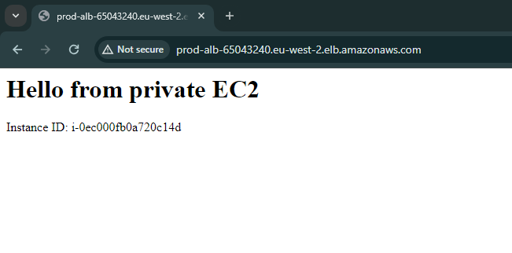
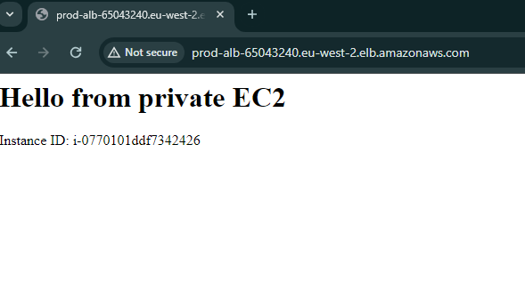
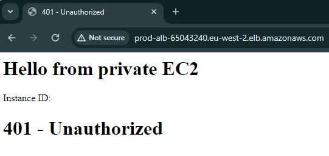

# AWS ALB → Private EC2 (Production Style Architecture)

This project demonstrates a production style AWS web architecture where an
**internet-facing Application Load Balancer (ALB)** routes traffic to
**EC2 instances in private subnets**, with no public IPs on the instances.

The focus is on **networking, security boundaries, and real-world troubleshooting**.

---

## Architecture Overview

- Custom VPC (10.10.0.0/16)
- Two public subnets (ALB)
- Two private subnets (EC2)
- Internet Gateway for public ingress
- NAT Gateway for private outbound access
- Application Load Balancer (HTTP :80)
- EC2 instances running Nginx in private subnets
- IAM role + AWS Systems Manager (no SSH)

Traffic flow:
Internet → ALB (public subnet) → EC2 (private subnet)

---

## Security Design

- **ALB Security Group**
  - Inbound: HTTP 80 from 0.0.0.0/0
- **EC2 Security Group**
  - Inbound: HTTP 80 **only from the ALB security group**
- EC2 instances have **no public IPs**
- EC2 managed using **SSM**, not SSH

---

## What I Built

- Custom VPC with public and private subnets across two AZs
- Internet-facing ALB in public subnets
- Private EC2 instances behind the ALB
- Target group + health checks
- NAT Gateway to allow private instances outbound access (updates + SSM)
- Nginx installed automatically via user data

---

## Proof of Load Balancing

Refreshing the ALB DNS endpoint returns different EC2 instance IDs,
proving traffic is load-balanced across private instances.

| Instance A | Instance B |
|-----------|------------|
|  |  |

---

## Troubleshooting & Real-World Issues

### 1. 502 Bad Gateway (Initial)
Private instances were unhealthy because they had **no outbound access**.
Without a NAT Gateway, user data could not install Nginx.

**Fix:** Added a NAT Gateway and private route table, then relaunched instances.

---

### 2. 401 Unauthorized (IMDSv2)
Amazon Linux 2023 enforces **IMDSv2**.
Accessing instance metadata without a token returned `401 Unauthorized`.

**Fix:** Used SSM Run Command with an IMDSv2 token to update the page.

---

## Key Learnings

- Public vs private subnets are defined by **routing**, not naming
- Private instances need NAT or VPC endpoints for outbound access
- Amazon Linux 2023 requires **IMDSv2 tokens** for metadata access
- SSM Run Command allows secure management of private EC2 instances without SSH

---

## Cleanup

All resources were deleted after testing:
- EC2 instances
- ALB and target groups
- NAT Gateway and Elastic IP
- Route tables, subnets, and VPC

---

## Tools & Services Used

- AWS EC2
- Application Load Balancer
- VPC, Subnets, Route Tables
- NAT Gateway
- IAM
- AWS Systems Manager

