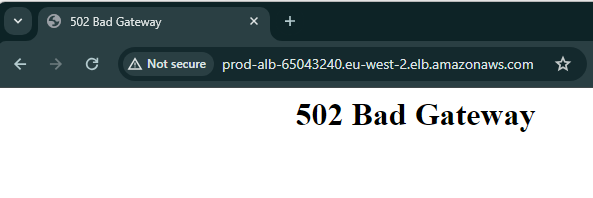

# AWS ALB → Private EC2 (Production Style Architecture)

This project demonstrates a production style AWS web architecture where an
**internet-facing Application Load Balancer (ALB)** routes traffic to
**EC2 instances in private subnets**, with no public IPs on the instances.

The focus is on **networking, security boundaries, and real-world troubleshooting**.

---

## Architecture Overview

- Custom VPC (10.10.0.0/16)
- Two public subnets (ALB)
- Two private subnets (EC2)
- Internet Gateway for public ingress
- NAT Gateway for private outbound access
- Application Load Balancer (HTTP :80)
- EC2 instances running Nginx in private subnets
- IAM role + AWS Systems Manager (no SSH)

Traffic flow:

